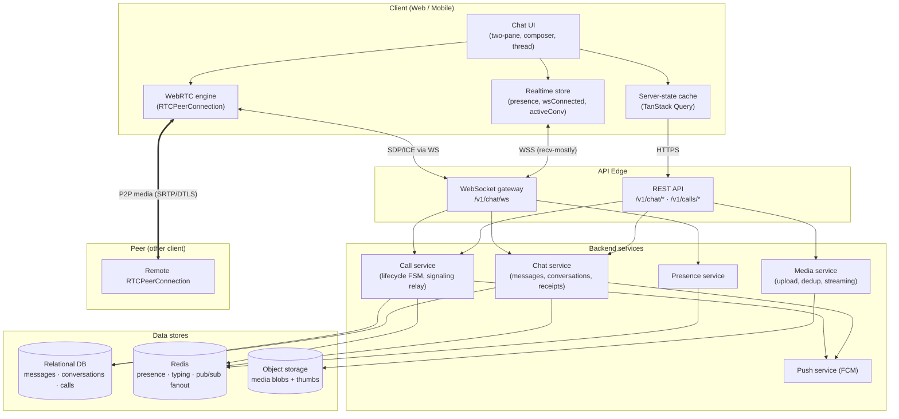
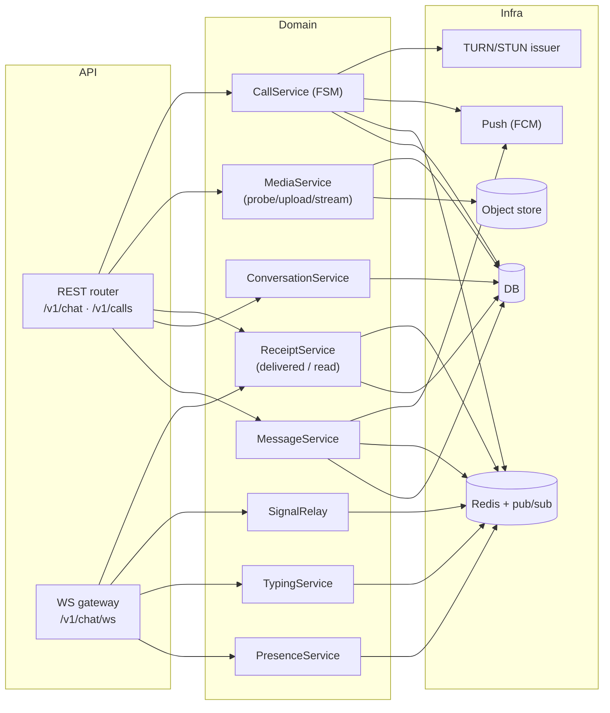
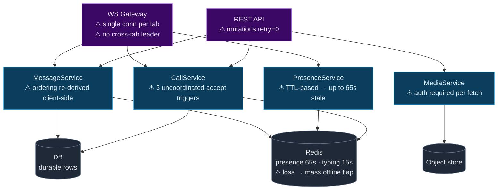
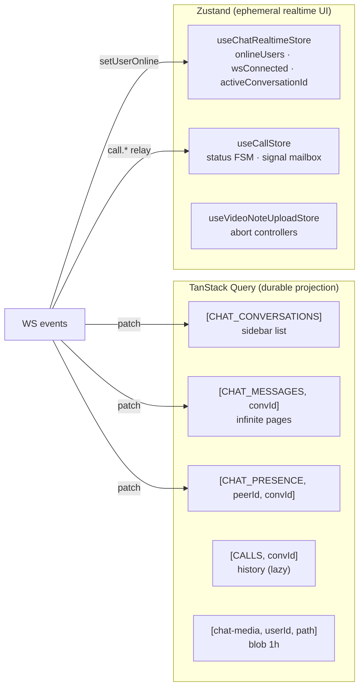
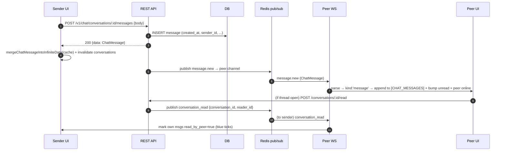
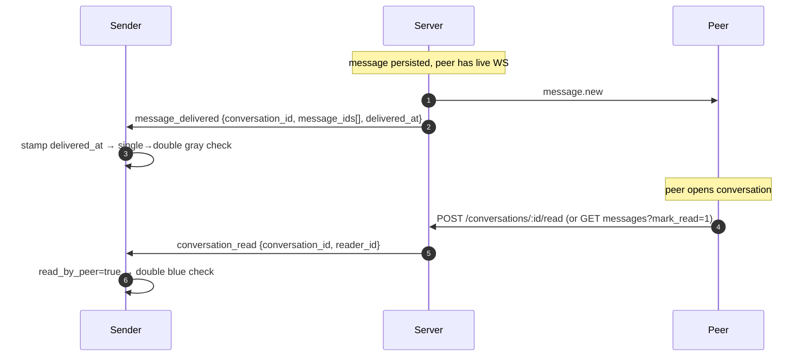
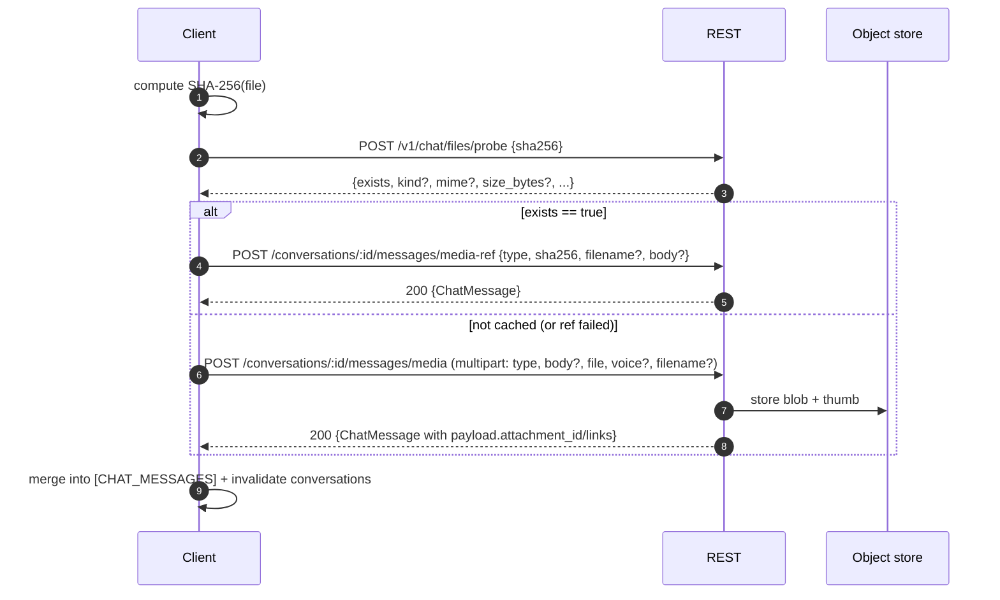
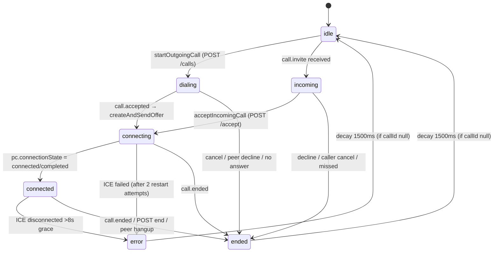

# Техническое задание (TZ) — Chat Messenger

> **Full backend + frontend technical specification for building a 1:1 real-time chat messenger with audio/video/screen-share calling, feature-parity with the reference implementation.**
>
> This document is the single source of truth for **both** teams. Every REST endpoint, WebSocket event, data schema, Redis key, timer, and UI feature below is reverse-engineered from a working production implementation and is normative unless marked *(recommended)* or *(open question)*.
>
> - Reference stack of the source app: React 19 + Vite + Ant Design 6 + TanStack Query 5 + Zustand 5 (FE); Go-style REST + WebSocket + Redis (BE, inferred from contract docs).
> - The **new** messenger may use any stack, but **must** honor the wire contracts (REST paths, WS event names, envelope shapes, Redis TTLs) verbatim so FE and BE built independently interoperate.

---

## Table of contents

1. [Scope & goals](#1-scope--goals)
2. [Glossary](#2-glossary)
3. [Architecture (arch)](#3-architecture-arch)
4. [System-design graphs (sys-design)](#4-system-design-graphs-sys-design)
5. [Flow graphs](#5-flow-graphs)
6. [Data model](#6-data-model)
7. [Transport contract — HTTP envelope & headers](#7-transport-contract--http-envelope--headers)
8. [REST API contract](#8-rest-api-contract)
9. [WebSocket contract](#9-websocket-contract)
10. [Presence & typing subsystem](#10-presence--typing-subsystem)
11. [Calls / WebRTC subsystem](#11-calls--webrtc-subsystem)
12. [Functional requirements (feature spec)](#12-functional-requirements-feature-spec)
13. [Non-functional requirements](#13-non-functional-requirements)
14. [Frontend implementation spec](#14-frontend-implementation-spec)
15. [Backend implementation spec](#15-backend-implementation-spec)
16. [Acceptance criteria](#16-acceptance-criteria)
17. [Open questions & known discrepancies](#17-open-questions--known-discrepancies)

---

## 1. Scope & goals

### 1.1 In scope
- **1:1 direct messaging** (no group chats). Two-user conversations only.
- **Message types:** text, image, video, audio/voice, round video-notes ("kruzhok"), documents, location (read/render), and system call-event messages.
- **Realtime delivery** of messages, edits, deletes, delivery receipts, read receipts, presence (online/last-seen), and typing indicators over a single WebSocket.
- **Media pipeline:** authenticated upload (multipart), SHA-256 dedup upload-by-reference, authenticated media fetch/download, thumbnails.
- **Audio / video / screen-share calling** (WebRTC P2P, 1:1) with call history, ICE server provisioning, and full signaling relayed over the same chat WebSocket.
- **Notifications:** in-app notification cards with inline quick-reply, OS-level notifications when backgrounded, global unread badge, notification sound.
- **Presence system** backed by Redis with exact TTLs.
- Full **i18n**, **light/dark theming**, **mobile-responsive** two-pane layout, **accessibility** (reduced-motion, ARIA), and **offline/reconnect resilience**.

### 1.2 Out of scope (explicitly not built in the reference)
- Group chats / channels / broadcast lists.
- Reply-to / quote a specific message. **(Not implemented in source.)**
- Message forwarding. **(Not implemented in source.)**
- Message reactions / stars / pins.
- Client-side "share my location" send flow (location messages are render-only).
- End-to-end encryption (transport is TLS only; no E2EE).
- SFU / multi-party (3+) calls — architecture is pure P2P mesh of size 2.
- Stickers & GIFs (UI tabs exist but are "Coming soon" placeholders).

### 1.3 Success criteria
- FE and BE developed independently against this TZ interoperate with zero contract negotiation.
- All timers/TTLs match §10 exactly (a mismatched typing TTL or presence TTL produces stale dots and stuck "typing…").
- Calls connect P2P through NAT via server-provided TURN; signaling never breaks due to event-name drift (§9.4).

---

## 2. Glossary

| Term | Meaning |
|---|---|
| **Conversation** | A 1:1 chat between `user_a` and `user_b`. Identified by `conversation_id` (UUID). |
| **Peer** | The *other* participant in a conversation from the current user's viewpoint. |
| **Envelope** | The uniform `{status, code, description, data}` wrapper around every REST response. |
| **Wire type** | The literal `type`/`event` string on a WS frame (e.g. `message.new`, `webrtc.ice`). |
| **Internal kind** | The normalized enum the FE reduces every wire type to (e.g. `message`, `webrtc_ice`). |
| **Video-note / kruzhok** | A short (≤60s) round video message, Telegram-style. |
| **Presence** | `{online, last_seen, typing}` state of a user, computed from Redis. |
| **Media-ref** | Sending a message that reuses an already-uploaded file by its SHA-256 (dedup, no re-upload). |
| **Signaling** | WebRTC SDP offer/answer + ICE candidate exchange, relayed over the chat WS. |

---

## 3. Architecture (arch)

### 3.1 System context



**Key architectural decisions:**

- **CQRS-ish split.** The WebSocket is **receive-mostly**: the *only* things the client sends over WS are `ping`, `typing`, `typing_stop`, and WebRTC signaling. **All state mutations (send/edit/delete message, mark-read, media upload, call create/accept/end) go over REST.** The WS then *notifies* peers of those mutations. This keeps the socket thin and the API idempotent/cacheable.
- **Media is never relayed.** Audio/video call media flows P2P (WebRTC SRTP). The server relays only SDP + ICE. No SFU.
- **Redis is the presence brain.** Online/typing/last-seen live in Redis with hard TTLs; the DB stores only durable message/call rows.
- **Client cache authority.** The FE treats TanStack Query caches as the projection of server state; WS events *patch* those caches directly (no full refetch on the happy path). HTTP polling is a slow degrade fallback only.

### 3.2 Frontend folder architecture (arch — feature-first)

```
src/
├── pages/chat/
│   ├── ChatPage.tsx                     # orchestrator: layout, state wiring, WS hook, mutations
│   ├── components/
│   │   ├── ChatSidebarPanel.tsx         # conversation list + search + self footer
│   │   ├── ConversationItem.tsx         # one row: avatar, dot, preview, unread badge, tick
│   │   ├── ChatThreadPanel.tsx          # header, message list, day separators, call popover
│   │   ├── MessageBubble.tsx            # per-message renderer (all types) + context menu
│   │   ├── MessageMeta.tsx              # timestamp + delivery/read ticks
│   │   ├── ChatComposerPanel.tsx        # input, emoji, attach, send, voice/video buttons
│   │   ├── ChatEmojiPickerPanel.tsx     # lazy emoji picker (+ sticker/GIF placeholders)
│   │   ├── ChatMediaCaptionModal.tsx    # pre-send preview + caption
│   │   ├── ChatMedia.tsx                # image/video render (lightbox, download)
│   │   ├── ChatVoiceMessage.tsx         # waveform player
│   │   ├── ChatVideoNoteRecorder.tsx    # full-screen round recorder
│   │   ├── ChatVideoNoteRing.tsx        # progress ring (record + playback + upload)
│   │   ├── ChatVideoNoteMessage.tsx     # round player w/ PiP + autoplay-on-scroll
│   │   ├── ChatLinkifiedText.tsx        # URL auto-linking
│   │   ├── ChatThreadBackground.tsx     # animated blurred blob background
│   │   └── ChatMessageNotificationCard.tsx
│   ├── hooks/
│   │   ├── useChatMessagesQuery.ts      # infinite query (cursor pagination)
│   │   ├── useChatSocketEvents.ts       # WS event → cache patch dispatcher
│   │   ├── useChatTypingState.ts        # typing emit + peer-typing lifecycle
│   │   ├── useChatPresenceSubtitle.ts   # header status line
│   │   ├── useChatComposerActions.ts    # send/edit/voice send + validation
│   │   ├── useChatMediaUploadMutation.ts# SHA-256 probe → media-ref | multipart
│   │   ├── useChatMediaSrc.ts           # authenticated blob fetch for media
│   │   ├── useChatCallsQuery.ts         # call history (lazy)
│   │   ├── useChatUserSearch.ts         # global people search
│   │   ├── useChatConversationRouting.ts# ?conversation= / ?peer= deep links
│   │   ├── useChatConversationPresentation.ts
│   │   ├── useChatMessageListActions.ts # load-older + scroll anchoring
│   │   ├── useChatSearchHotkey.ts       # Ctrl/Cmd+K
│   │   └── useChatVoiceRecordingEffects.ts
│   └── utils/
│       ├── chatRealtime.ts              # reconnect backoff schedule
│       ├── chatFormat.ts                # previews, role labels, initials, linkify
│       ├── chatCallEvents.ts            # parse in-thread call-event messages
│       ├── chatVideoNoteRecorder.ts     # MediaRecorder pipeline
│       ├── chatConstants.ts             # all timers/sizes/limits
│       └── downloadChatMedia.ts
├── components/shared/
│   ├── GlobalChatRealtimeBridge.tsx     # app-wide WS: notifications, badges, call relay
│   └── GlobalAudioCallModal.tsx         # entire call UI + WebRTC engine
├── components/ui/ChatButton.tsx         # floating unread FAB (app-wide)
├── stores/
│   ├── useChatRealtimeStore.ts          # {activeConversationId, wsConnected, onlineUsers}
│   ├── useCallStore.ts                  # call FSM status + signal mailbox
│   └── useVideoNoteUploadStore.ts       # abortable upload tracking
├── types/{chatTypes.ts, callTypes.ts, basicTypes.ts}
├── constants/{endpoints.ts, queryKeys.ts}
└── utils/{chatHelpers.ts, webrtcTuning.ts, callDebug.ts, appHeight.ts}
```

**Rule:** all HTTP goes through a single typed client (endpoint strings from a constants enum, never inlined); the chat WS URL is built by one factory (`buildChatWebSocketUrl`); all message/presence data lives in the query cache, only ephemeral realtime UI state lives in Zustand.

### 3.3 Backend service architecture (arch)



- **WS gateway** holds live connections, subscribes each to a Redis pub/sub channel per user, and fans out events. On connect: set presence, flush undelivered backlog, broadcast `presence:online`, auto-transition stuck RINGING calls (>30s) → MISSED. On disconnect: set offline + last_seen, broadcast `typing_stop` for the user's active conversations.
- **SignalRelay** is stateless: it validates the sender is a party to `call_id` and forwards `webrtc.*` frames to the other party's connection(s).
- **CallService** owns the `RINGING→ACTIVE→ENDED/…` FSM, idempotency via `client_request_id`, and the RINGING-timeout sweeper.

---

## 4. System-design graphs (sys-design)

### 4.1 Component / data-store map with failure modes



**Scaling ceilings / managed-service equivalents:**

| Component | Ceiling | Failure mode | Managed equivalent |
|---|---|---|---|
| WS Gateway | ~50–100k conns/node (fd + memory bound) | Node death drops all its sockets → clients reconnect w/ backoff | AWS API Gateway WebSocket / Ably / Pusher |
| Redis presence | Memory-bound; every online user = 1 key + pub/sub sub | Redis outage → everyone flaps offline, typing stuck until 15s TTL | ElastiCache / Upstash |
| Media storage | Object-store bound | Auth fetch adds latency vs CDN | S3 + signed URLs / CloudFront |
| TURN relay | Bandwidth-bound (relayed calls carry full media) | No TURN → NAT-restricted calls fail | Twilio TURN / coturn cluster / Cloudflare Calls |
| DB messages | Write-bound on hot conversations | — | Aurora / Cloud SQL + read replicas |

### 4.2 Client cache & store topology



---

## 5. Flow graphs

### 5.1 Send text message (REST write → WS fanout)



### 5.2 Delivery & read receipts



### 5.3 Presence & typing lifecycle

```mermaid
sequenceDiagram
  autonumber
  participant U as User A
  participant SV as WS Gateway
  participant RD as Redis
  participant P as User B
  U->>SV: WS connect ?token&device_type&language&client_token
  SV->>RD: SET chat:presence:A "1" EX 65
  SV->>P: presence {user_id:A, online:true}
  loop every 54s
    SV-->>U: ws ping
    U-->>SV: pong  (refreshes presence TTL)
  end
  U->>SV: typing {data:{conversation_id}}
  SV->>RD: SET chat:typing:conv:A "1" EX 15
  SV->>P: typing {conversation_id, user_id:A}
  Note over U: throttle sends to 1/2.8s; idle 5s → typing_stop
  U->>SV: typing_stop {data:{conversation_id}}
  SV->>RD: DEL chat:typing:conv:A
  SV->>P: typing_stop {conversation_id, user_id:A}
  Note over U: on WS close → SV marks offline, sets chat:lastseen:A, broadcasts presence:false
```

### 5.4 Media upload with SHA-256 dedup



### 5.5 Call setup (REST lifecycle + WS signaling + P2P media)

```mermaid
sequenceDiagram
  autonumber
  participant CA as Caller
  participant SV as Server (REST+WS)
  participant CE as Callee
  CA->>SV: POST /v1/calls {peer_id, conversation_id?, client_request_id, call_type}
  SV-->>CA: 201 {call: RINGING}
  SV->>CE: WS call.invite {call, caller_name, caller_phone, call_type}
  Note over CE: ring UI (audio/video variant)
  CE->>SV: POST /v1/calls/:id/accept
  SV->>CA: WS call.accepted
  SV->>CE: WS call.accepted
  CA->>CA: createOffer (Opus munge, VP9 pref)
  CA->>SV: WS webrtc.offer {call_id, payload:SDP}
  SV->>CE: WS webrtc.offer
  CE->>CE: setRemoteDescription → createAnswer
  CE->>SV: WS webrtc.answer {call_id, payload:SDP}
  SV->>CA: WS webrtc.answer
  par ICE trickle both ways
    CA->>SV: WS webrtc.ice {call_id, payload:candidate}
    SV->>CE: WS webrtc.ice
    CE->>SV: WS webrtc.ice
    SV->>CA: WS webrtc.ice
  end
  CA<-->CE: P2P media (SRTP/DTLS via STUN/TURN)
  Note over CA,CE: status connecting → connected (pc.connectionState)
  CA->>SV: POST /v1/calls/:id/end {reason}
  SV->>CE: WS call.ended
  Note over CA,CE: both close RTCPeerConnection, stop tracks
```

### 5.6 Call FSM (client `useCallStore` status)



---

## 6. Data model

### 6.1 Response envelope (all REST)

```ts
type ApiResponse<T> = {
  status: 'success' | 'error' | string
  code: number                 // HTTP-ish code
  description: string          // ALREADY localized per X-Language — safe to show to user
  data: T | null
}
```

### 6.2 Message type enum

Backend accepts **both** lower_snake and legacy UPPERCASE aliases; the client normalizes both:

```
text | img | audio | video | video_note | location | document | call
TEXT | PHOTO | VOICE | AUDIO | VIDEO | VIDEO_NOTE | LOCATION | DOCUMENT
```

### 6.3 ChatMessage

```ts
type ChatMessage = {
  id: string                  // uuid
  conversation_id: string     // uuid
  sender_id: string           // uuid
  type: ChatMessageType
  body: string | null         // text OR media caption
  payload: ChatMediaPayload | ChatLocationPayload | ChatCallPayload | null
  created_at: string          // RFC3339Nano UTC
  updated_at: string          // == created_at unless edited
  deleted_at: string | null   // soft delete tombstone
  delivered_at: string | null // null until delivered to peer device
  read_by_me: boolean         // current user has read this (peer's) message
  read_by_peer: boolean       // peer has read this (my) message
  optimistic?: { localUrl: string } // CLIENT-ONLY, never sent by server
}
```

### 6.4 ChatMediaPayload

```ts
type ChatMediaPayload = {
  attachment_id?: string       // → GET /v1/chat/media/:id
  link?: string | null         // relative API link
  url?: string | null
  links?: { media?: string | null; thumb?: string | null } | null
  thumb_url?: string | null
  mime?: string                // e.g. "video/mp4"
  size_bytes?: number          // int64
  duration_ms?: number | null  // audio/video/video_note
  width?: number | null
  height?: number | null
  filename?: string | null
  name?: string | null
}
```

### 6.5 ChatLocationPayload / ChatCallPayload

```ts
type ChatLocationPayload = { lat: number; lng: number; address: string | null; place_id: string | null }

type ChatCallPayload = {
  direction?: 'incoming' | 'outgoing' | null  // AUTHORITATIVE for bubble side
  status?: string | null
  duration_seconds?: number | null
  ended_reason?: string | null
  ended_by_side?: string | null
}
```

### 6.6 Conversation

```ts
type ChatParticipant = { id: string; name: string | null; phone: string; role: string }

type ChatConversation = {
  id: string
  peer_id: string
  peer: ChatParticipant | null
  last_message: ChatMessage | null
  unread_count: number
  created_at: string
  updated_at: string
  peer_has_photo?: boolean
  peer_photo_url?: string | null
  // Summary fields (server wire names in parens) — used for list previews w/o loading messages:
  summary_last_message_at?: string | null       // last_message_at
  summary_preview?: string | null               // last_message_preview / last_message_body
  summary_last_message_type?: ChatMessageType | null // last_message_type
  summary_from_me?: boolean | null              // last_message_from_me
  summary_peer_read?: boolean | null            // peer_read_my_last
  summary_last_message_id?: string | null       // last_message_id
}
```

> **Server-side conversation model** (durable): `id, user_a_id, user_b_id, created_at`, plus denormalized last-message summary and per-side unread counters (`unread_count`, `unread_from_peer_count`, `unread_my_count`, `unread_total_count`, `peer_read_my_last`). Conversation is get-or-create by `{peer_id}`.

### 6.7 Presence

```ts
type ChatPresence = {
  user_id: string
  online: boolean
  last_seen: number | null  // unix SECONDS; present only when online=false
  typing: boolean | null    // present only when queried with ?conversation_id=
}
```

### 6.8 Call

```ts
type CallStatus = 'RINGING' | 'ACTIVE' | 'ENDED' | 'DECLINED' | 'MISSED' | 'CANCELLED' | 'FAILED'
type CallType   = 'audio' | 'video' | 'screen'

type Call = {
  id: string
  conversation_id: string | null
  caller_id: string
  callee_id: string
  status: CallStatus
  call_type?: CallType | null
  created_at: string
  started_at: string | null
  ended_at: string | null
  ended_by: string | null
  ended_reason: string | null
  client_request_id: string | null   // idempotency key
}

type CallIceServer = { urls?: string | string[]; username?: string | null; credential?: string | null }
```

### 6.9 User search

```ts
type ChatUserFinderItem = {
  role: string; id: string; phone: string; name: string | null
  has_photo?: boolean; photo?: string | null; photo_url?: string | null
}
// GET /v1/chat/user-finder?phone=...&limit=... → ApiResponse<{ items?: ChatUserFinderItem[] }>
```

### 6.10 List response shapes (tolerant)

```ts
ConversationsResponse = ApiResponse<{ items?: unknown[]; conversations?: unknown[]; total?: number }>
MessagesResponse      = ApiResponse<{ items?: unknown[]; messages?: unknown[]; cursor?: string | null }>
```
Client accepts either `items` or the type-specific array key.

---

## 7. Transport contract — HTTP envelope & headers

### 7.1 Required headers on every `/v1/*` request

| Header | Value | Notes |
|---|---|---|
| `X-User-Token` | `<JWT access token>` | **Authoritative auth header** (matches live test harness). Admin methods require `role=admin` in the JWT. |
| `X-Client-Token` | opaque string / UUID | App/session fingerprint for extra access checks. |
| `X-Device-Type` | `web` \| `ios` \| `android` | |
| `X-Language` | `ru, uz, oz, en, tr, zh, kk, tg, ky` (+ `tk` client-side) | Server localizes `description` + push text. Unsupported codes fall back server-side (`kk/ky/tk/tg→ru`, `lv/lt/et/pl/de→en`). |
| `X-User-ID` | uuid | Debug/test only; ignored in prod runtime. |

> **Discrepancy:** one doc uses `Authorization: Bearer <token>` instead of `X-User-Token`. **Build the backend to accept BOTH**, prefer `X-User-Token`. See §17.

### 7.2 WebSocket / SSE auth

Browsers cannot set headers on `WebSocket`/`EventSource`, so **WS auth is via `token` query param only** (see §9.1). Same pattern for any SSE stream.

### 7.3 Time & tokens

- All timestamps: **RFC3339Nano UTC** (`2026-06-02T10:30:00.123456789Z`).
- Token object: `{access_token, refresh_token, expires_in, expires_at, refresh_expires_in, refresh_expires_at}`. Access TTL observed `43200s` (12h) in a real capture (openapi example says `900s` — confirm with server config). Refresh TTL `604800s` (7d).
- REST 401 → inline refresh-then-retry via role-scoped `POST /v1/{role}/auth/refresh {refresh_token}`; retry the original request once with the new token. Concurrent 401s must queue behind a single refresh (refresh token is single-use/rotated).

---

## 8. REST API contract

All paths are under `/v1`. All responses are `ApiResponse<T>`.

### 8.1 Chat

| # | Method | Path | Request | Response `data` | Purpose |
|---|---|---|---|---|---|
| 1 | GET | `/chat/user-finder?phone=&limit=` | — | `{ items: ChatUserFinderItem[] }` | Global people search to start a chat (min 3 chars, debounce 350ms client-side). |
| 2 | GET | `/chat/users/:id/photo` | — | image bytes | Peer avatar. |
| 3 | GET | `/chat/conversations?limit=100` | — | `{ items: ChatConversation[] }` | Sidebar list. |
| 4 | POST | `/chat/conversations` | `{ peer_id }` | `ChatConversation` | Get-or-create 1:1 conversation. |
| 5 | POST | `/chat/conversations/:id/read` | `{}` | `{ ok }` | Mark conversation read → broadcasts `conversation_read`. |
| 6 | GET | `/chat/conversations/:id/messages?limit=50&mark_read=1` / `&cursor=` / `&before=` | — | `{ items: ChatMessage[], cursor?: string\|null }` | Paginated history (newest→oldest). First page passes `mark_read=1`. |
| 7 | POST | `/chat/conversations/:id/messages` | `{ body }` | `ChatMessage` | Send text. |
| 8 | POST | `/chat/conversations/:id/messages/media` | multipart: `type, body?, file, voice?, filename?` | `ChatMessage` | Fresh media upload. |
| 9 | POST | `/chat/conversations/:id/messages/media-ref` | `{ type, sha256, filename?, body? }` | `ChatMessage` | Send by existing file reference (dedup). |
| 10 | POST | `/chat/files/probe` | `{ sha256 }` | `{ exists, kind?, mime?, size_bytes?, duration_ms?, width?, height?, has_thumb? }` | Dedup existence check before upload. |
| 11 | PATCH | `/chat/messages/:id` | `{ body }` | `ChatMessage` | Edit (text only) → broadcasts `message_updated`. |
| 12 | DELETE | `/chat/messages/:id` | — | `{ deleted: boolean }` | Soft delete → broadcasts `message_deleted`. |
| 13 | GET | `/chat/media/:id` | — (auth) | blob | Stream media by attachment id. |
| 14 | GET | `/chat/files/:id` | — (auth) | blob | Legacy alias of #13. |
| 15 | GET | `/chat/presence/:user_id?conversation_id=` | — | `ChatPresence` | Online/typing/last-seen. `typing` only returned when `conversation_id` given; `last_seen` only when `online=false`. |
| 16 | POST | `/chat/push-token` | `{ token, ... }` | `{ ok }` | Upsert FCM token; stores `X-Language` for localized push. |
| 17 | DELETE | `/chat/push-token` | `{ token }` | `{ ok }` | Remove token on logout. |
| 18 | WS | `/chat/ws?token=&device_type=&language=&client_token=` | — | upgrade 101 | See §9. |

**Media `type` values** for #8/#9: `img | audio | video | video_note | document | VOICE` (voice messages upload with `type=VOICE` and duplicate the file under a `voice` form field).

### 8.2 Calls

| # | Method | Path | Request | Response `data` | Purpose |
|---|---|---|---|---|---|
| 1 | GET | `/calls?limit=50` | — | `{ calls: Call[] }` | Call history (lazy; only when history popover open). |
| 2 | POST | `/calls` | `CallCreateRequest {peer_id, conversation_id?, client_request_id?, call_type?}` | `{ call: Call }` (201, RINGING) | Create/initiate. Idempotent by `client_request_id`. |
| 3 | GET | `/calls/ice-servers` | — | `{ ice_servers: CallIceServer[] }` | Fetch fresh ICE/TURN per call (staleTime 15min; re-invalidate on ICE failure). |
| 4 | GET | `/calls/:id` | — | `{ call: Call }` | Poll during dialing/connecting (3s) + on reconnect. 404 ⇒ treat as ended. |
| 5 | POST | `/calls/:id/accept` | `{}` | `{ call: Call }` | Callee accepts → `call.accepted` broadcast. |
| 6 | POST | `/calls/:id/decline` | `{ reason? }` | `{ call: Call }` | Callee declines. |
| 7 | POST | `/calls/:id/cancel` | `{}` | `{ call: Call }` | Caller cancels before ACTIVE. |
| 8 | POST | `/calls/:id/end` | `{ reason? }` | `{ call: Call }` | Either party ends an ACTIVE call. |
| 9 | GET | `/calls/test/bootstrap` | — | `{ current_user_id }` | Dev/test only. |

### 8.3 Error codes

| HTTP | i18n key | Meaning |
|---|---|---|
| 400 | `invalid_payload_detail` | Bad/missing fields (e.g. invalid user id). |
| 401 | `user_not_identified` / missing `X-User-Token` | Auth required → refresh+retry. |
| 403 | `forbidden` | Not a party / no access. |
| 404 | `conversation_not_found` / `call_not_found` | Gone. |
| 409 | `call_user_busy` / `call_peer_busy` / `call_invalid_state` | Call conflict. |
| 429 | `rate_limited` | Throttled (no concrete numbers documented — see §17). |
| 500 | `internal_error` | Server fault (transient — do not log out). |

---

## 9. WebSocket contract

### 9.1 Connection

- **URL:** `{wss|ws}://{host}/v1/chat/ws?token={JWT}&device_type={web|ios|android}&language={code}&client_token={X-Client-Token}`
  - Scheme: `wss:` if API is `https:`, else `ws:`. Host/path derived from the API base URL; a trailing `/v1` on the base path is stripped before appending `/v1/chat/ws`.
  - `language` is passed through the same fallback mapping as `X-Language`.
- **Auth:** validated from the `token` query param at handshake. Bad token ⇒ reject the upgrade.
- **Single socket, `share: true`:** one native socket per tab is shared across all subscribers (chat page + global bridge + call modal). **No cross-tab leader election** — each tab has its own socket.
- **Keepalive:** client sends `{ "type": "ping" }` immediately on open, then every **25000ms**. Server sends its own WS ping every **54s**; client's pong refreshes presence TTL.
- **Reconnect (client):** on close, reconnect while a token exists, backoff schedule `[1000, 2000, 5000, 10000]ms` (attempt N clamps into that array; 4th+ capped at 10s), **max 12 attempts**. *(Alternate doc: exponential 1s→cap 30s — either is acceptable; the array schedule is what the reference FE ships.)*
- **On reconnect** (not first open): resync — invalidate conversations, invalidate active-conversation messages, invalidate peer presence, re-POST mark-read.

### 9.2 Server → client events

Wire `type` (or `event`) string → normalized internal `kind`. The parser is deliberately liberal (accepts `type`/`event`, nested `data.type`, id/field aliases, and a bare message object with `id`+`conversation_id`+`sender_id`).

| Wire type(s) | Internal kind | Payload (`data`) |
|---|---|---|
| bare msg obj, `message`, `message.new`, `message.created` | `message` | full `ChatMessage` |
| `message.updated`, `message_updated` | `message_update` | full `ChatMessage` |
| `message.deleted`, `message_deleted` | `message_delete` | `{ conversation_id, message_id }` |
| `message_delivered`, `message.delivered` | `message_delivered` | `{ conversation_id, message_ids: string[], delivered_at }` |
| `conversation_read`, `conversation.read` | `conversation_read` | `{ conversation_id, reader_id }` |
| `presence`, `presence.update` | `presence` | `{ user_id, online, last_seen?, typing? }` |
| `typing`, `typing.start` | `typing` | `{ conversation_id, user_id, typing: true }` |
| `typing.stop`, `typing_stop`, `typing_stopped` | `typing` | `{ conversation_id, user_id, typing: false }` |
| `call`, `call.invite`, `call.ringing` | `call_invite` | `{ call, caller_name?, caller_phone?, call_type? }` |
| `call.accept`, `call.accepted` | `call_accept` | `{ call }` |
| `webrtc.offer`, `call.webrtc.offer` | `webrtc_offer` | `{ call_id, from_id?, payload: RTCSessionDescriptionInit }` |
| `webrtc.answer`, `call.webrtc.answer` | `webrtc_answer` | `{ call_id, from_id?, payload: RTCSessionDescriptionInit }` |
| `webrtc.ice`, `webrtc.candidate`, `call.webrtc.ice`, `call.webrtc.candidate` | `webrtc_ice` | `{ call_id, from_id?, payload: RTCIceCandidateInit }` |
| `call.reject/.cancel/.declined/.cancelled/.ended/.missed/.missed.system/.failed/.end` | `call_end` | `{ call }` (distinguished by `event_type`) |
| anything else | `ignored` | — |

> **Normalization happens in exactly one place** (`parseChatWebSocketPayload`). All downstream code sees only the internal `kind`.

### 9.3 Client → server events

The **entire** outbound vocabulary:

| Trigger | Frame |
|---|---|
| keepalive (on open + every 25s) | `{ "type": "ping" }` |
| user typing (throttled ≥2.8s) | `{ "type": "typing", "data": { "conversation_id": "..." } }` |
| typing stop (idle 5s / blur / send / switch / unmount) | `{ "type": "typing_stop", "data": { "conversation_id": "..." } }` |
| WebRTC offer | `{ "type": "webrtc.offer",  "data": { "call_id", "payload": <SDP> } }` |
| WebRTC answer | `{ "type": "webrtc.answer", "data": { "call_id", "payload": <SDP> } }` |
| WebRTC ICE | `{ "type": "webrtc.ice",    "data": { "call_id", "payload": <candidate> } }` |

Server also accepts **flat** typing shapes (`{type:'typing', conversation_id}`) for mobile clients — accept both flat and `data`-nested.

> There is **no** WS frame for send/edit/delete/mark-read/join — those are REST (§8).

### 9.4 ⚠ Signaling event-name warning (load-bearing)

The **live server relays bare-dotted `webrtc.offer` / `webrtc.answer` / `webrtc.ice`**. A legacy doc's `call.webrtc.*` and `webrtc.candidate` spellings are **not** what the server forwards. **The new backend MUST pick one canonical set and the FE MUST match.** Recommendation: canonical = `webrtc.offer`, `webrtc.answer`, `webrtc.ice`; accept `webrtc.candidate` as an inbound alias for robustness. Getting this wrong = calls ring but never connect.

---

## 10. Presence & typing subsystem

### 10.1 Redis keys (exact — normative)

| Key | TTL | Value | Meaning |
|---|---|---|---|
| `chat:presence:{user_id}` | **65 seconds** | `"1"` | User online. Refreshed by WS ping/pong or any WS activity. |
| `chat:typing:{conv_id}:{user_id}` | **15 seconds** | `"1"` | User typing in a conversation. |
| `chat:lastseen:{user_id}` | **30 days** | unix seconds | Last-seen timestamp for offline display. |

### 10.2 Server behavior

- **Online** = presence key exists. **Offline** ⇒ read `last_seen` from lastseen key.
- On WS **connect:** set presence (EX 65) → broadcast `presence{online:true}` to peers → flush undelivered backlog → auto-transition RINGING>30s calls → MISSED.
- On WS **disconnect:** delete presence, set lastseen = now, broadcast `presence{online:false, last_seen}`, and broadcast `typing_stop` for the user's active conversations.
- On **typing** frame: set typing key EX 15 → relay `typing` to peer. On **typing_stop:** delete key immediately → relay `typing_stop`.
- **Ping** every 54s keeps a silent (read-only) client online via pong.

### 10.3 Client timers (exact — normative)

| Timer | Value | Where |
|---|---|---|
| Ping interval | 25000ms | outbound keepalive |
| Typing send throttle | 2800ms | max 1 `typing` frame per this window while typing |
| Typing idle → stop | 5000ms | no keystroke ⇒ emit `typing_stop` |
| Typing blur debounce | 220ms | emit stop shortly after blur |
| Peer typing_stop grace | 1200ms | wait before clearing peer "typing…" (anti-flicker) |
| Peer typing hard-clear failsafe | 5000ms | clear peer typing if no further event |
| Peer typing Redis-TTL fallback | 15000ms | mirrors `chat:typing` TTL; force-clear stale typing |
| Presence poll (WS up) | 15000ms | HTTP `GET /presence/:id` reconciliation |
| Presence poll (WS down) | 3000ms | faster fallback when socket dead |
| Messages poll (WS up / down) | 20000ms / 4000ms | fallback refetch |
| Conversations poll (WS down) | 20000ms | fallback |

### 10.4 Client presence model

- `onlineUsers: Record<lowercased_user_id, boolean>` in Zustand drives the green dot everywhere. Updated by: `presence` events, peer `typing:true` (forces online), peer `message` in active thread (forces online), and every HTTP presence poll (source of truth reconciliation, self-heals a missed event).
- Header subtitle priority: **typing… > online > "last seen {relative}" > offline > blank**.

---

## 11. Calls / WebRTC subsystem

### 11.1 Transport split
- **REST = state changes:** create / accept / decline / cancel / end, ICE-server fetch, history, poll-by-id.
- **WS = notifications + media negotiation:** `call.invite/accepted/ended/...` and all `webrtc.offer/answer/ice`.
- The client also runs a **3s REST poll of `/calls/:id`** during dialing/incoming/connecting as a resilience fallback for dropped WS events.

### 11.2 RTCPeerConnection config
- `iceServers` = `GET /calls/ice-servers` result; **fallback** to `[{urls:'stun:stun.l.google.com:19302'}]` if empty (no TURN fallback — NAT-restricted calls need server TURN).
- Fetch ICE **fresh per call** (server may issue short-lived TURN creds via a `CALLS_TURN_SECRET`-style HMAC; env `CALLS_ICE_URLS` includes `stun:`/`turn:`/`turns:` udp+tcp+tls). Re-invalidate on ICE failure.

### 11.3 Media constraints
```
AUDIO_CONSTRAINTS  = { echoCancellation:true, noiseSuppression:true, autoGainControl:true }   // always
CAMERA_CONSTRAINTS = { width:{ideal:640}, height:{ideal:360}, frameRate:{ideal:20,max:24} }    // video calls
SCREEN_CONSTRAINTS = { frameRate:{ideal:8,max:15} }                                            // screen share
```
- Audio failure aborts the call. Camera failure in a video call degrades to audio-send / video-receive.

### 11.4 The "stable slot" transceiver pattern (critical)
Create **one audio (`sendrecv`) + one video transceiver up front on every call, even pure audio** (video track null initially). Then camera-on, screen-share, and camera↔screen swaps use `RTCRtpSender.replaceTrack()` with **zero renegotiation**. Toggling mic = `track.enabled=false` (never remove the track).

### 11.5 Offer/answer ordering
1. Caller `POST /calls` → build PC + transceivers → status `dialing` (**no offer yet**).
2. On `call.accepted` → caller `createOffer` → Opus-munge SDP → `setLocalDescription` → send `webrtc.offer`.
3. Callee `setRemoteDescription(offer)` → flush queued ICE → `createAnswer` → munge → send `webrtc.answer`.
4. Caller accepts answer only if `signalingState === 'have-local-offer'` → `setRemoteDescription` → flush ICE → `connecting`.
5. Dedup guards (`offerInFlightRef`, `lastAnsweredOfferSdpRef`) because three uncoordinated triggers can fire the offer (own WS handler, store-relay, 3s poll).

### 11.6 ICE
- Trickle: send every non-null candidate immediately as `webrtc.ice`. Buffer candidates arriving before `remoteDescription` exists; flush right after `setRemoteDescription`.
- Restart: on `iceConnectionState==='failed'`, **caller only** does `restartIce()` + re-offer `{iceRestart:true}`, max 2 attempts, 1.5s re-arm lock; then `cleanup('error', preserveSession:true)`.
- Transient `disconnected`: 8s grace → error (session preserved so "Hang up" still works).

### 11.7 Codec/bitrate tuning
- **Opus SDP munge** (offer+answer): force `useinbandfec=1;usedtx=1;stereo=0;maxaveragebitrate=24000;maxplaybackrate=16000`.
- **Video codec preference:** `setCodecPreferences(['video/vp9','video/vp8','video/av1','video/h264'])`.
- **Sender params:** camera `{maxBitrate:300000, maxFramerate:20, degradationPreference:'maintain-framerate', contentHint:'motion'}`; screen `{maxBitrate:800000, maxFramerate:10, degradationPreference:'maintain-resolution', contentHint:'text'}`.

### 11.8 Screen share
- `getDisplayMedia({video:SCREEN_CONSTRAINTS, audio:false})`, `contentHint='text'`, mutually exclusive with camera (stop camera first), then `replaceTrack`. Native "Stop sharing" fires `track.onended` → auto stop. Desktop only (`getDisplayMedia` present && !mobile).
- Platform notes for native apps: iOS needs a Broadcast Upload Extension (ReplayKit) or in-app `RPScreenRecorder`; Android needs MediaProjection + a foreground service (`mediaProjection` type). All funnel into the same `replaceTrack` — **no backend change per platform**.

### 11.9 Call UI (overlay)
- Ringing tones synthesized via Web Audio (distinct incoming/outgoing/accepted/ended/rejected sequences); AudioContext unlocked on first user gesture (Safari).
- Incoming: full-screen dialog, avatar/name/phone, audio variant = Decline/Accept/Mute; video variant = Mute/Decline/Answer-with-video + "Answer without camera" link.
- In-call: screen-share (desktop), camera toggle, end (danger), mute; minimize → draggable compact pill (bottom-right). Escape minimizes (never drops) a connected call.
- Timer `MM:SS` from first `connected`. Remote-camera-off watchdog (400ms interval + 1500ms staleness) falls back to avatar when peer frames go stale (since `replaceTrack(null)` may not fire `mute`).
- Reload recovery: persist active call id in `sessionStorage` (`sarbon:active-call`, per-tab/per-user); on reconnect re-fetch `/calls/:id` and re-hydrate if still RINGING/ACTIVE.

### 11.10 In-thread call-event messages
Call outcomes also appear as system `ChatMessage`s (`type:'call'`) with a body like `"call.ended:2"` or `"incoming call: missed"`. Prefer structured `payload.direction`/`payload.status` over parsing the body. Bubble side = **call direction** (outgoing=own), not `sender_id`. Status category → icon/color: `ended`(green) / `rejected`=cancelled|declined(red) / `default`=missed|failed|ringing|active(neutral). Duration label from `payload.duration_seconds`. Tapping the bubble re-dials.

---

## 12. Functional requirements (feature spec)

Each item is a **must** unless marked *(nice-to-have)*.

### 12.1 Conversation list / sidebar
- FR-1 Permanent search bar (not togglable) with OS-aware shortcut hint (`⌘K`/`Ctrl+K`); global `Ctrl/Cmd+K` focuses it; clear-`×` button.
- FR-2 Sort conversations by `summary_last_message_at ?? last_message.created_at ?? updated_at`, newest first.
- FR-3 Client-side filter of existing conversations by name/phone/preview (case-insensitive, no debounce).
- FR-4 Search mode splits results into **Chats** (existing) and **Global search** (people not yet chatted, phone-based user-finder, min 3 chars, 350ms debounce); "Nothing found" empty state.
- FR-5 Row: avatar + live online dot (from `onlineUsers`), bold name→phone→"Unknown user" fallback, role label, last-message preview.
- FR-6 Preview priority: `summary_preview` → type icon+label (📷 image / video-note / 🎥 video / 🎙 voice / 📍 location) → raw text → `[type]`; deleted ⇒ "Message deleted"; `You:` prefix for own last message.
- FR-7 Own-message tick next to timestamp (single gray = sent, double blue = read). Timestamp `HH:mm` today else `DD.MM.YYYY`.
- FR-8 Unread badge (caps "99+"), hidden for the active conversation.
- FR-9 Active row highlight; hover state; per-row divider.
- FR-10 Self footer bar (own avatar/name/phone).
- FR-11 States: loading spinner, zero-conversations empty w/ CTA, no-search-results empty, searching-people spinner.

### 12.2 Deep-linking
- FR-12 `?conversation=<id>` reflects/restores active conversation (replace-nav).
- FR-13 `?peer=<userId>` bootstraps (or opens) a conversation with that user, then strips the param; guard against double-create.
- FR-14 If active conversation disappears from list, clear active state + param.

### 12.3 Thread header
- FR-15 Mobile back arrow; peer avatar (click → photo preview) + online dot; name→phone fallback; subtitle = typing / role · presence.
- FR-16 Audio + video call buttons; disabled when WS down (`callUnavailable`) or a call is active/ringing/error (`callBusy`) with explanatory tooltip.
- FR-17 "⋮" popover → recent calls (lazy fetch, up to 8, refresh button, status label, date/time, computed duration, outgoing/incoming badge).

### 12.4 Message thread
- FR-18 Animated blurred-blob background (reduced-motion → static).
- FR-19 "Load older messages" at top; preserve scroll anchor after load.
- FR-20 Sticky day separators (Today/Yesterday/`DD.MM.YYYY`).
- FR-21 "Unread messages" divider inserted once before first unread (computed on open).
- FR-22 Own vs peer bubble alignment/colors + corner notch; distinct shells for call-event and video-note.
- FR-23 Render all message types (text, image, video, audio/voice, video-note, location w/ "Open in Maps", document w/ size+download, call-event).
- FR-24 Linkify URLs (`http(s)://`, `www.`), trailing punctuation excluded, `target=_blank`.
- FR-25 Media captions under media.
- FR-26 "edited" tag when `updated_at` > `created_at` + 1s.
- FR-27 Deleted ⇒ italic "Message deleted" tombstone (keeps position).
- FR-28 Own read receipts: single (sent) / double gray (delivered) / double blue (read), derived by `getOwnMessageReadReceipt` (read_by_peer → read; delivered_at or not-newest → delivered; else single).
- FR-29 Context menu (right-click / long-press): Download (images), Edit (own text, not call/deleted), Delete (own).
- FR-30 Edit flow: composer edit banner, Enter save (PATCH), Esc/× cancel.
- FR-31 Delete flow: confirm modal → DELETE → optimistic `deleted_at`.
- FR-32 Scroll: instant jump to newest on open (`useLayoutEffect`); smooth auto-scroll on new msg/typing **only if within 80px of bottom**; floating "scroll to latest" FAB with unread badge when scrolled away.
- FR-33 Peer typing indicator: three bouncing dots, left-aligned, animate in/out.

### 12.5 Composer
- FR-34 Auto-grow textarea (1–6 rows), disabled while uploading; `data-chat-composer-input` for auto-focus.
- FR-35 Send button (paper-plane) shown only with non-whitespace text; else mic (+ camera if supported) shown.
- FR-36 Enter=send, Shift+Enter=newline, Esc=cancel edit.
- FR-37 Attach (paperclip) → hidden file input (images/audio/video/pdf/office/archives/text); validation pipeline: type → audio codec → size limit (localized error each).
- FR-38 Emoji picker (lazy, tabbed): Emoji (search, theme-aware), Stickers/GIFs "Coming soon" *(nice-to-have)*; selecting appends + retriggers typing.
- FR-39 Typing emission per §10.3 (throttle 2.8s, idle-stop 5s, blur/send/switch/unmount stop).
- FR-40 Fixed blue composer bar with iOS safe-area padding; auto-focus on conversation activate.

### 12.6 Media / caption
- FR-41 Pre-send preview modal (title by kind; img/video/audio/document previews; filename + human size for audio/doc; caption textarea Enter-to-send).
- FR-42 SHA-256 probe → media-ref or multipart (§5.4); progress callback + AbortSignal (video-note).
- FR-43 On success: merge into cache + invalidate conversations.

### 12.7 Voice messages
- FR-44 Record via MediaRecorder (mime preference mp4→ogg/opus→webm/opus→webm), 200ms chunks, min 600ms (else "too short" toast).
- FR-45 Recording composer: pulsing dot + `mm:ss,cc` timer; **slide-to-cancel** swipe (−72px threshold, red "Release to cancel"); trash cancel; up-arrow stop+send; outside-tap cancels.
- FR-46 Playback bubble: play/pause, deterministic 48-bar waveform seeded by message id, seekable bars, rAF-driven progress, duration label (payload `duration_ms` fallback), own/peer color themes, optional caption.

### 12.8 Video notes (kruzhok)
- FR-47 Full-screen recorder opens camera immediately, **auto-starts recording**; circular mirrored preview; progress ring (amber warning at 55s, hard cap 60s, min 1s to send).
- FR-48 Pause/resume (if supported), camera flip (canvas pipeline; disabled iOS), device select (desktop, >1 camera), cancel/Esc; stop auto-sends (no review screen).
- FR-49 Constraints: ~640px 1:1, 1.2 Mbps cap; auto-stop on tab hidden or track end; full teardown on close.
- FR-50 Playback: circular bubble, progress ring (playback + upload), autoplay-muted on scroll-into-view (IntersectionObserver 60%), tap-to-unmute/focus, second tap toggle, **only one plays at a time**, PiP follower when scrolled out while playing, mute toggle, duration + meta overlays.
- FR-51 Optimistic sending bubble from local object URL + cancel (×) via `useVideoNoteUploadStore` AbortController.

### 12.9 Media rendering / download
- FR-52 Images via lightbox (zoom/pan) with prepended Download button + right-click "Download image".
- FR-53 Videos: `<video controls playsInline>`.
- FR-54 All chat media fetched through **authenticated blob proxy** (`useChatMediaSrc`) for same-host URLs (adds auth headers, strips base path, caches blob per user 1h, 404-aware); cross-origin/CDN used directly.
- FR-55 Documents: file icon, filename (payload→body→generic), human size, authenticated download honoring `Content-Disposition` filename (RFC 5987), fallback open-in-tab.
- FR-56 Skeletons while loading; error alert on failure.

### 12.10 Notifications & unread
- FR-57 In-app notification card (non-auto-dismiss) for incoming messages on non-active conversations: avatar, name, type-aware preview, **inline quick-reply** (posts without opening chat), click → open `?conversation=`.
- FR-58 Dedup by message id (cap 500), suppress own messages + active conversation, auto-dismiss when unread hits 0 / opened.
- FR-59 Notification sound + OS `showLocalNotification` when tab backgrounded.
- FR-60 Floating `ChatButton` FAB (hidden on chat page) with total-unread badge ("99+"), polls conversations every 10s, bounce/pop animations.
- FR-61 Mark-read on open: POST read endpoint, zero unread optimistically, clear related OS notifications.

### 12.11 Realtime
- FR-62 Single shared WS per tab; backoff reconnect; reconnect resync (§9.1).
- FR-63 Handle all inbound kinds per §9.2 with cache patches per §14.3; call-signaling kinds ignored at chat-page level (handled by call modal).
- FR-64 25s ping keepalive.

### 12.12 Calls (from chat)
- FR-65 Header audio/video buttons → `useCallStore.requestStartCall(convId, peerId, name, phone, type)`.
- FR-66 Call-event bubbles re-dial on tap.
- FR-67 Full call subsystem per §11.

---

## 13. Non-functional requirements

- **NFR-1 Performance:** message list virtualization not required by source but recommended for large threads; media lazy-loaded; blob cache 1h; manual vendor chunking. Target Lighthouse ≥ 90 on the chat route.
- **NFR-2 Resilience:** transient failures (offline/timeout/5xx) must **not** log the user out; only definitive 400/401/403 or specific refresh-failure markers clear the session. Mutations `retry:0`; queries `retry:1`.
- **NFR-3 Reconnect:** WS backoff + full resync; media/message polling fallback rates per §10.3.
- **NFR-4 i18n:** every string localized; peer roles + call statuses + type previews localized; backend `description` already localized. Support the full language set incl. locale fallback mapping.
- **NFR-5 Theming:** light/dark on every surface (bubbles, backgrounds, dividers, badges, emoji picker) via CSS tokens.
- **NFR-6 Accessibility:** reduced-motion fallback for every animation (background, scroll, video-note overlay, list stagger); ARIA dialog/modal on call overlay; sufficient contrast on disabled controls; keyboard: Enter/Shift+Enter/Esc, Ctrl+K.
- **NFR-7 Mobile:** two-pane → single-pane collapse; `--app-height` from `visualViewport` (keyboard-safe) with hysteresis; hide app navbar on chat route; hide FAB on chat page; safe-area insets in composer/FAB.
- **NFR-8 Security:** auth on every REST + WS (token query for WS); media requires auth (no public blob URLs for same-host); validate sender is a conversation/call party server-side on every WS relay; never trust client-provided `sender_id`/`direction` for authorization; rate-limit send + upload + call-create (values TBD, §17).
- **NFR-9 Observability:** opt-in call debug (`localStorage['sarbon:call-debug']='1'`) logging ICE/TURN presence, signaling steps; structured server logs for WS connect/disconnect, presence flaps, call FSM transitions.
- **NFR-10 Idempotency:** call-create idempotent by `client_request_id`; message send should tolerate client retry without duplication (server dedup or client single-flight).

---

## 14. Frontend implementation spec

### 14.1 State ownership
- **TanStack Query** owns durable data: `[CHAT_CONVERSATIONS]`, `[CHAT_MESSAGES, convId]` (infinite), `[CHAT_PRESENCE, peerId, convId]`, `[CALLS, convId]`, `[chat-media, userId, path]`.
- **Zustand** owns ephemeral realtime UI: `useChatRealtimeStore {activeConversationId, wsConnected, onlineUsers}`, `useCallStore {status, signal mailbox}`, `useVideoNoteUploadStore {abort controllers}`.

### 14.2 Pagination
- `useInfiniteQuery` on `[CHAT_MESSAGES, convId]`, page size **50**. First page: `mark_read=1`, no cursor. Next: `cursor=<pageParam>`. `getNextPageParam`: prefer `data.cursor`; else if page count < 50 ⇒ end; else next cursor = id of oldest message in page. Merge all pages: dedup by id into a Map, sort ascending by `created_at`. Load-older restores scroll by adding height delta to `scrollTop`.

### 14.3 WS event → cache patch table

| kind | Patch |
|---|---|
| `message` | active thread: append to messages cache (`mergeChatMessageIntoInfiniteData`), mark peer online, clear typing, mark-read; else debounced (500ms) conversations invalidate. Always patch conversations row (last_message, preview, unread++ unless mine/active/dup). |
| `message_update` | replace in messages cache; invalidate on miss; invalidate conversations. |
| `message_delivered` | stamp `delivered_at` on matching ids in messages + conversations last_message. |
| `conversation_read` | reader≠me ⇒ flag my sent messages `read_by_peer=true`; conversations: reader=me ⇒ unread=0, else `peer_read_my_last=true`. |
| `message_delete` | stamp `deleted_at` (tombstone); invalidate conversations. |
| `presence` | merge into matching `[CHAT_PRESENCE,*]` (only fields present), update `onlineUsers`, arm/clear 15s typing fallback. |
| `typing` | patch `[CHAT_PRESENCE,userId]` typing/online; update `onlineUsers`; forward to composer typing UI if active. |
| `webrtc_*` / `call_*` | ignored here; handled by call modal / bridge relay. |

### 14.4 Media src resolution
`getChatMediaPath(payload)` → prefer `links.media` → `url` → `link` → build `/v1/chat/media/:attachment_id`. `resolveChatMediaUrl` → absolute as-is, else prefix API base. `useChatMediaSrc` → if same host as API, authenticated `GET responseType:'blob'` (+ `X-User-ID`) → `createObjectURL` (revoke on unmount); else use URL directly. Cache `['chat-media', userId, path]` 1h.

### 14.5 Mount points
- `GlobalChatRealtimeBridge` — app-wide (top level, gated by auth, not on admin routes): owns the WS ping, writes `wsConnected`, drives notifications + badges + call lifecycle relay into `useCallStore`.
- `GlobalAudioCallModal` — app-wide overlay: subscribes to the shared WS for `webrtc.*` + call lifecycle; the WebRTC engine.
- `ChatPage` — the chat route: its own `useWebSocket` (shared socket) drives message/typing/presence UI.

---

## 15. Backend implementation spec

### 15.1 Services & responsibilities
- **ConversationService:** get-or-create by `{peer_id}`; maintain denormalized last-message summary + per-side unread counters; enforce requester ∈ {user_a,user_b}.
- **MessageService:** persist text/media; set `delivered_at` when peer has a live WS; publish `message.new`/`message_updated`/`message_deleted` to peer channel; soft-delete via `deleted_at`; trigger push when peer offline.
- **ReceiptService:** on `POST /read` (or `mark_read=1`), zero reader unread, mark peer's messages read, broadcast `conversation_read`; on delivery, broadcast `message_delivered {message_ids[]}`.
- **PresenceService / TypingService:** Redis keys + TTLs per §10.1; broadcast presence/typing.
- **MediaService:** `POST /files/probe` (hash lookup), multipart upload (store blob + generate thumb, extract duration/dimensions), `media-ref` (attach existing blob), authenticated streaming `GET /media/:id` with `Content-Disposition`.
- **CallService:** FSM + idempotency by `client_request_id`; RINGING>30s → MISSED sweeper; issue ICE servers (short-lived TURN creds); persist call rows; emit call-event system messages into the transcript.
- **SignalRelay:** validate party membership; forward `webrtc.*` verbatim to the other party.
- **PushService:** FCM; use stored `X-Language` per token for localized text.

### 15.2 WS gateway
- Auth from `token` query at upgrade. Maintain per-user connection set (multi-device). Subscribe each connection to the user's Redis pub/sub channel. Send server ping every 54s; refresh presence on pong/activity. On connect/disconnect run the side effects in §10.2.
- Accept both flat and `data`-nested typing frames. Normalize/emit signaling using the canonical names in §9.4.

### 15.3 Persistence (relational)
- `conversations(id, user_a_id, user_b_id, created_at, last_message_id, last_message_at, last_message_type, last_message_body, last_message_from_me, peer_read_my_last, unread_a, unread_b, ...)` with a unique constraint on the unordered pair `{user_a_id,user_b_id}`.
- `messages(id, conversation_id, sender_id, type, body, payload jsonb, created_at, updated_at, deleted_at, delivered_at, read_by_a, read_by_b)`; index `(conversation_id, created_at desc)` for history + cursor pagination.
- `calls(id, conversation_id, caller_id, callee_id, status, call_type, created_at, started_at, ended_at, ended_by, ended_reason, client_request_id unique)`.
- `attachments(id, sha256, mime, size_bytes, duration_ms, width, height, has_thumb, storage_key)` with unique `sha256` for dedup.

### 15.4 Envelope & localization
- Wrap every REST response in `{status, code, description, data}`; localize `description` by `X-Language`. Timestamps RFC3339Nano UTC.

---

## 16. Acceptance criteria

A build is **done** when all pass:

1. **Interop:** independently-built FE and BE exchange messages, receipts, presence, and typing with no contract patching.
2. **Receipts:** sending shows single→double-gray on delivery, double-blue on peer read; matches §5.2 timing.
3. **Presence accuracy:** dot goes green ≤1s after peer connect (WS) and self-heals within one poll after a dropped event; goes gray on disconnect; "last seen" shows correct relative time.
4. **Typing:** peer "typing…" appears within throttle window, clears within 1.2s of stop, never sticks past 15s even if `typing_stop` is lost.
5. **Media:** image/video/voice/document/video-note upload, dedup-by-hash (second identical upload uses `media-ref`, no re-upload), authenticated fetch renders, download honors server filename.
6. **Voice:** slide-to-cancel, waveform seek, <600ms discarded.
7. **Video-note:** auto-start record, 60s cap w/ amber warning, one-at-a-time playback, autoplay-on-scroll, PiP follower, cancelable optimistic upload.
8. **Calls:** audio + video + screen-share connect P2P through NAT via server TURN; mute/camera/screen toggles have zero renegotiation; ICE-restart recovers a flapped call; RINGING>30s auto-MISSED; reload mid-call re-hydrates.
9. **Signaling robustness:** calls connect using the canonical `webrtc.offer/answer/ice` names; a wrong-name frame is the only thing that breaks connection (§9.4 honored).
10. **Notifications:** background OS notification + in-app card + sound for non-active conversations; inline quick-reply posts; unread badge accurate; dedup works.
11. **Resilience:** kill the WS → UI keeps working via polling and fully resyncs on reconnect; a 5xx/offline never logs the user out.
12. **A11y/i18n/theme/mobile:** reduced-motion respected; all strings localized; light+dark correct; two-pane collapses and the composer stays above the mobile keyboard.

---

## 17. Open questions & known discrepancies

| # | Item | Detail | Recommended resolution |
|---|---|---|---|
| Q1 | **Auth header name** | Docs split between `X-User-Token` and `Authorization: Bearer`. Live test harness uses `X-User-Token`. | Backend accepts **both**; FE sends `X-User-Token`. |
| Q2 | **ICE event name** | `webrtc.ice` (live harness) vs `webrtc.candidate` (guide). | Canonical `webrtc.ice`; accept `webrtc.candidate` inbound alias. |
| Q3 | **Access-token TTL** | Real capture `43200s` (12h) vs openapi example `900s`. | Confirm with server config; default 12h. |
| Q4 | **`X-Language` enum** | `tk` present in FE table but absent from openapi enum; extended locales (`lv/lt/et/pl/de`) fall back. | Accept superset; apply documented fallback mapping server-side. |
| Q5 | **Rate limits** | No concrete numbers documented anywhere (only generic 429). | Define: e.g. send 10/s burst, upload 5/min, call-create 3/min per user; return `Retry-After`. |
| Q6 | **Media size/type limits** | Not documented. | Define whitelist (image/*, audio/*, video/*, pdf/office/archive/text) + max size (e.g. 50MB media, 20MB doc); enforce server-side. |
| Q7 | **TURN infra** | No concrete TURN hosts/creds documented (only client STUN fallback). | Stand up coturn (or managed) with HMAC short-lived creds via `/calls/ice-servers`; **without TURN, ~10–20% of calls fail on symmetric NAT**. |
| Q8 | **Dispatcher dual-delivery** | Reference app also pushes chat/call events over a separate SSE unified stream for dispatchers. | For a standalone messenger, **WS-only** is sufficient; SSE duplication is a reference-app integration detail, not required. |
| Q9 | **Multi-tab** | No cross-tab leader; each tab holds its own WS and pings independently. | Acceptable; optionally add a BroadcastChannel leader later to save connections. |
| Q10 | **WS token refresh mid-session** | No documented token-expiry WS event; relies on close→reconnect (re-reads fresh token). | Server closes socket on JWT expiry; client reconnect picks up refreshed token. Optionally add an `auth_error` close code. |

---

*End of TZ. This document is normative for the wire contracts (§6–§11) and functionally complete for feature parity (§12). Sections marked (open question) in §17 require a product/infra decision before implementation.*
