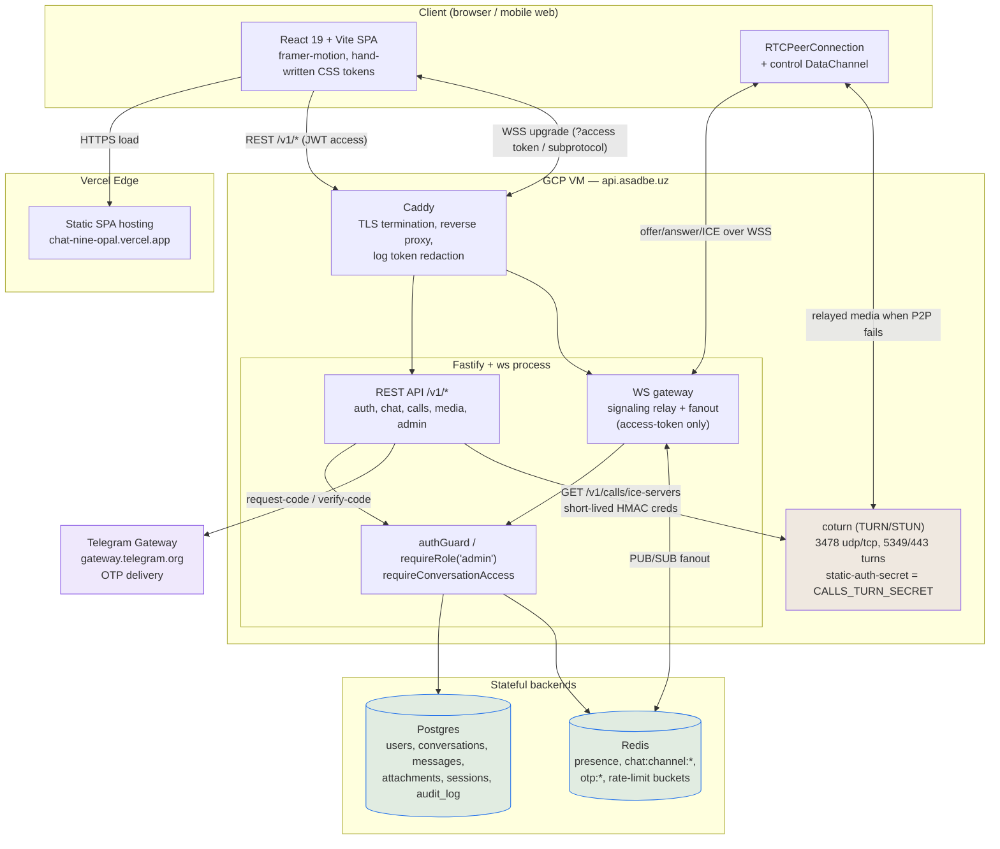
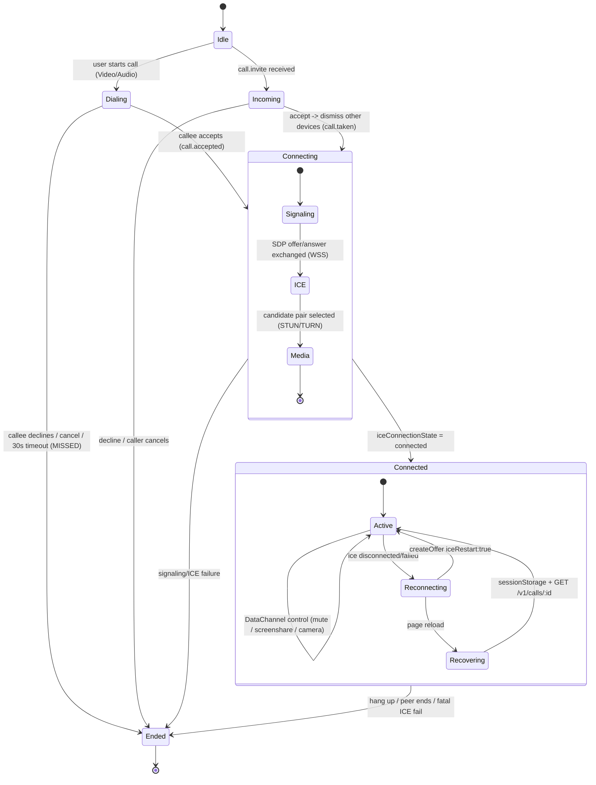
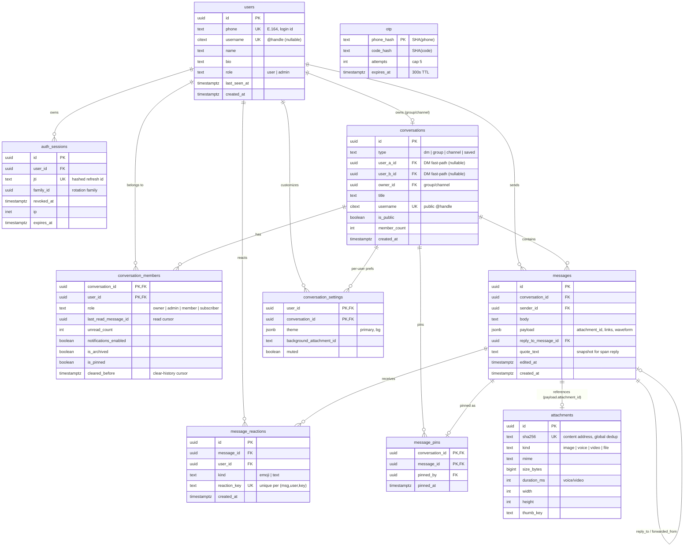
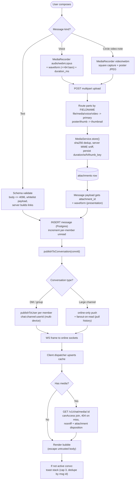
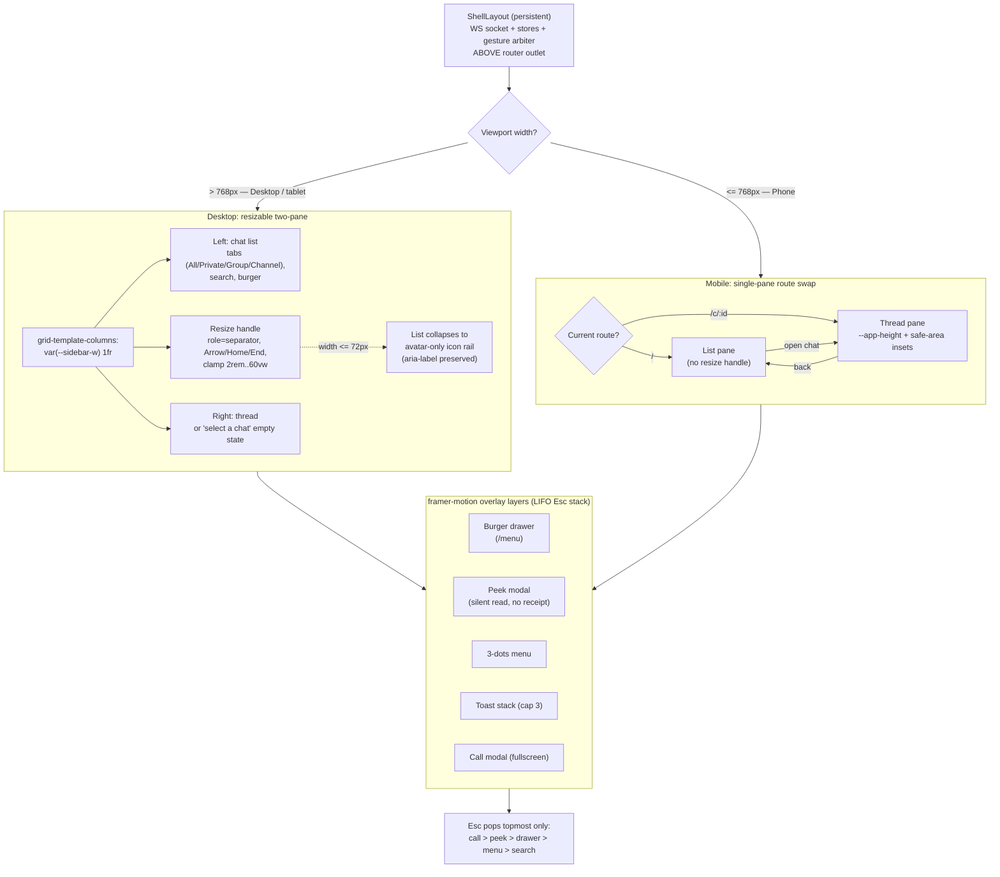

# Chat Messenger — Architecture Diagram Suite

> GitHub-renderable Mermaid diagrams distilled from the 5-architect design pass
> (`security-admin`, `backend-datamodel`, `realtime-calls-media`, `frontend-ux`,
> `scope-premortem`) against `SPEC-SOURCE.md`. Each section pairs a diagram with a
> short reading guide. Stack: React 19 + Vite on Vercel → Caddy TLS → Fastify + `ws`
> → Postgres + Redis, with coturn (TURN) for WebRTC and the Telegram Gateway for OTP.

---

## 1. System Architecture

The browser app is served statically from Vercel and talks to a single origin,
`https://api.asadbe.uz`, terminated by **Caddy** (TLS + request-log token redaction).
Caddy reverse-proxies both REST (`/v1/*`) and the WebSocket upgrade to one **Fastify + ws**
process on the GCP VM. Fastify owns durable state in **Postgres** (users, conversations,
messages, attachments) and volatile/real-time state in **Redis** (presence, per-user fanout
channels `chat:channel:<userId>`, OTP challenges, rate-limit buckets). Two out-of-band
integrations sit beside the API: **coturn** on the same VM relays WebRTC media when direct
STUN candidate pairs fail (~20-30% of NAT topologies), sharing the `CALLS_TURN_SECRET` HMAC
scheme; and the **Telegram Gateway** delivers login OTP codes. Media blobs are content-addressed
and access-gated per request (no public bucket) to close the IDOR surface.



---

## 2. Auth / OTP Sequence

Login is phone-first. `POST /v1/auth/request-code` normalizes to E.164, enforces per-phone
and per-IP Redis rate limits, stores only `SHA-256(code)` under `otp:req:<hash>` (300s TTL),
and dispatches the code via the Telegram Gateway — always answering a uniform `code_sent` so
account existence never leaks. `POST /v1/auth/verify-code` constant-time-compares against the
stored hash **or** the ENV-gated test OTP `136092` (honored only when
`AUTH_ALLOW_TEST_OTP && NODE_ENV!=='production'`; a boot invariant refuses to start prod
otherwise). On success the code is deleted (single-use), an `auth_sessions` row is created with
a rotating `jti`, and an access/refresh token pair is minted with `role` read **from the DB**,
never from client input. A brand-new number branches into registration (name + nickname) before
landing home; the test OTP verifies the phone step only and never grants admin.

```mermaid
sequenceDiagram
    autonumber
    actor U as User
    participant FE as Frontend (SPA)
    participant API as Fastify API
    participant R as Redis
    participant TG as Telegram Gateway
    participant DB as Postgres

    U->>FE: Enter phone number
    FE->>API: POST /v1/auth/request-code {phone}
    API->>API: Normalize to E.164
    API->>R: Check per-phone + per-IP limits
    alt Rate limit exceeded
        API-->>FE: 429 code_send_throttled
    else Allowed
        API->>API: Generate 6-digit code
        API->>R: SET otp:req:hash {SHA256(code), attempts:0} TTL 300s
        API->>TG: Deliver code to phone
        API-->>FE: 200 code_sent (uniform, no existence leak)
    end

    U->>FE: Enter code (real or test 136092)
    FE->>API: POST /v1/auth/verify-code {phone, code, nonce}
    API->>R: GET otp:req:hash
    alt attempts >= 5
        API->>R: Invalidate key
        API-->>FE: 429 otp_too_many_attempts
    else Verify
        API->>API: constant-time compare(code) OR<br/>env-gated test OTP (non-prod only)
        alt Code invalid
            API->>R: INCR attempts
            API-->>FE: 401 otp_invalid
        else Code valid
            API->>R: DEL otp:req:hash (single-use)
            API->>DB: getOrCreateByPhone(phone)
            alt New number (no account)
                API-->>FE: needs_registration
                U->>FE: Enter name + nickname
                FE->>API: POST /v1/auth/register {name, nickname}
                API->>DB: INSERT user (role='user')
            end
            API->>DB: Read role; INSERT auth_sessions {jti, family_id}
            API-->>FE: 200 {access (5-15m), refresh (rotating)}
            FE->>U: Home page
        end
    end

    note over API,DB: Later — refresh is stateful: verify jti not revoked,<br/>rotate (reuse ⇒ revoke family), re-read role from DB.
```

---

## 3. Call + WebRTC Lifecycle

The backend call REST stack (create/accept/decline/cancel/end + 30s ring sweep) is complete;
the frontend `useCallEngine()` drives the state machine below, fed by a typed `callBus`. Call
**lifecycle** transitions travel over REST; only `offer`/`answer`/`ice` travel over WSS, relayed
by the gateway after a call-membership check. Transceivers for both audio and video are warmed at
PeerConnection creation so an audio→video upgrade is a `replaceTrack` (no glare); the caller is the
impolite offerer under perfect-negotiation. In-call controls (mute, screen-share, camera flip,
upgrade request) ride an `RTCDataChannel`, not new WS frames. ICE failure triggers an ICE-restart
offer; a reload rehydrates an active call from `sessionStorage` + `GET /v1/calls/:id`.



---

## 4. Data-Model ERD

The recommended model keeps a **single polymorphic `conversations`** table
(`type ∈ dm | group | channel | saved`) rather than separate group/channel tables, so every
downstream table keys off one `conversation_id`. `conversation_members` is the per-user spine:
role, read cursor, unread count, archive/pin/mute, and clear-history cursor. DM rows keep the
legacy `user_a_id/user_b_id` fast-path (nullable, unique only `WHERE type='dm'`). Media
(`attachments`) is content-addressed by `sha256` and deduped globally, so authorization is on the
**message↔conversation edge**, never the attachment row. `auth_sessions` makes refresh tokens
revocable/rotating; the `otp` challenge state is short-lived (mirrored in Redis but shown here as
the durable contract). Reactions, pins, and per-chat settings hang off messages/conversations.



---

## 5. Message + Media Flow

Text messages validate against a schema (body ≤4096, whitelisted payload keys, server-built
links) and persist directly. Rich media — voice notes (`audio/webm;opus` + deterministic ≤64-bar
waveform + `duration_ms`) and round video-notes (square capture + poster frame) — upload as
multipart, routed **by fieldname** (`file/media/voice/video` → primary blob, `poster/thumb` →
thumbnail) so the poster is no longer dropped. `MediaService.store()` content-addresses by sha256
(dedup), sniffs the real MIME server-side, and persists metadata. Fanout is per-member via
`publishToConversation` (N=2 for DMs, looped members for groups; online-only push + fanout-on-read
for large channels). Every media **render** goes back through the auth-gated blob route
(`canAccess` join, 404 on miss, `nosniff` + attachment disposition), never a raw public URL.



---

## 6. Responsive Layout Map

Layout is **two regimes split by one breakpoint** (~768px), never one resizable mechanism forced
onto both. A persistent `ShellLayout` route mounts the WS socket, stores, and gesture arbiter
**above** the router outlet, so navigating between chats and overlay routes (`/menu`, `/me`,
`/settings`, `/saved`) never remounts the socket. On **desktop**, the shell is a resizable
two-pane grid (`--sidebar-w`, clamped 2rem…60vw via a keyboard-operable `role="separator"` handle);
below ~72px the list collapses to an avatar-only rail. On **mobile**, the same routes drive a
single pane that swaps list ⇄ thread (the resize handle is disabled). Overlays — burger drawer,
peek modal, 3-dots menu, toasts, call modal — render as framer-motion layers governed by a shared
LIFO overlay stack so one `Esc` closes exactly one layer.


